# 🛸 MISSION CONTROL — Master Architectural Directive & Operations Ledger
**Author & Director**: Jayson Quindao (`@djjrip`) — Founder & Managing Systems Architect, GG Loop LLC  
**AI Technical Staff**: Antigravity AI Engine  
**Last Synchronized**: September 8, 2026 (Live Audit & Hard Verification)  
**Permanent Repository**: [`djjrip/war-room-ops`](https://github.com/djjrip/war-room-ops)  

---

## 🧭 Executive Summary & Core Doctrine

This document represents the complete, unified operational ledger of all directives, technical requirements, system architectures, and future workflows established across Jayson Quindao's ecosystem. It bridges the gap between high-level vision and machine-verified execution.

### The Immutable Laws of Operation:
1. **Zero Theatre / No Performative Output**: No uncompiled code, speculative claims, or hypothetical roadmaps. Status is strictly binary: either it compiles with `Exit Code 0` and passes automated tests, or it does not exist.
2. **Hard Verification Standard**: All TypeScript, Node, and Python services must pass physical compiler checks (`npx tsc --noEmit`, `npm test`, `npm run build`) before being declared functional.
3. **The Director vs. Typing Boundary**: Jayson Quindao operates as the **Managing Systems Architect / Quality Director** (providing taste, strategy, skepticism, and commercial viability). The AI operates as the **Technical Engineering Crew** (typing, compiling, scanning, and introspecting).
4. **Zero-Dollar Budget Constraint**: All verification, deployment engines, and testing harnesses must operate at $0.00 idle cost, utilizing live public introspection and sandbox fallbacks rather than requiring credit cards or paid account overhead.

---

## 📊 Comprehensive Task Analysis: Past, Present & Future

```mermaid
graph TD
    A["Jayson Quindao (Managing Architect)"] --> B["Track 1: Identity & Brand"]
    A --> C["Track 2: Cloud Infrastructure & Runtimes"]
    A --> D["Track 3: Revenue & Bounty Radar"]
    A --> E["Track 4: Security & Hard Guardrails"]
    A --> F["Track 5: 20-Repo Portfolio Verification"]

    B --> B1["GitHub Profile Sync (djjrip/djjrip)"]
    B --> B2["LinkedIn Executive Architecture Blueprint"]
    B --> B3["Discord High-Signal Networking Protocol"]

    C --> C1["railway-orchestrator (Exit 0 Verified)"]
    C --> C2["Auto-Reaping Agent Sandbox Engine (TTL)"]
    C --> C3["temporal-deployment-engine (State Resiliency)"]

    D --> D1["Central Station Bounty Radar CLI ($130 Active)"]
    D --> D2["Verified Diagnostic Solutions (Next.js, Invites, Storage)"]

    E --> E1["Machine-Wide ~/.gitignore_global Configured"]
    E --> E2["Pre-Commit Git Hook Test & Build Barrier"]
    E --> E3["Deep 100-Commit Git History Secret Scan"]

    F --> F1["Truth Scoreboard (~/Projects/scoreboard.sh)"]
    F --> F2["14 Repos Triage & Installation Queue"]
```

---

## 🗂️ Track-by-Track Execution & Delegation Matrix

### Track 1: Identity, Brand & Leadership Connection
| Task ID | Item Description | Status | Assigned Tools / Delegation | Solutions Blueprint & Artifacts |
| :--- | :--- | :--- | :--- | :--- |
| **T1.1** | Define authentic, non-imposter identity | ✅ **COMPLETED** | Human Direction + Playbook | Defined as *Technical Founder & Managing Systems Architect*. Documented in `VIBE_CODER_PLAYBOOK.md` (Section 6). |
| **T1.2** | Flagship GitHub Profile (`djjrip/djjrip`) | ✅ **COMPLETED** | Git HTTPS + README sync | Added `railway-orchestrator` & `ggloop-cloud` to featured projects. Pushed commit `2ad6ba1`. |
| **T1.3** | LinkedIn Executive Presence | ⏳ **ACTIONABLE** | Copy-Paste Blueprint | Pre-drafted 2-line high-impact headline and zero-theatre About section ready for LinkedIn UI. |
| **T1.4** | Connecting with Founders & CEOs (Railway/Jake Cooper) | ⏳ **IN-PROGRESS** | GitHub PRs + Bounty Solutions | Focused on open-source contributions to `railwayapp/cli` & `railwayapp/nixpacks` rather than cold DMs. |

---

### Track 2: Cloud Infrastructure & Container Orchestration
| Task ID | Item Description | Status | Assigned Tools / Delegation | Solutions Blueprint & Artifacts |
| :--- | :--- | :--- | :--- | :--- |
| **T2.1** | `railway-orchestrator` Syntax & Types | ✅ **COMPLETED** | Next.js 14 App Router + TS | Fixed broken string interpolation, typed GraphQL client, verified `npm run build` (Exit 0). |
| **T2.2** | Real-Time Telemetry & Log Pipe | ✅ **COMPLETED** | Next.js API Routes | Added `/api/railway/logs/route.ts` with streaming container logs and status telemetry. |
| **T2.3** | Automated Unit Test Suite Verification | ✅ **COMPLETED** | Jest + React Testing Library | Rewrote `__tests__/page.test.tsx` with `getByRole` & fetch mocks. Verified 3/3 tests pass (Exit 0). |
| **T2.4** | Live Production Schema Introspection | ✅ **COMPLETED** | `curl` + GraphQL introspection | Introspected `backboard.railway.app/graphql/v2`. Proved `serviceCreate`, `serviceDelete`, `edges.node` match 1:1. |
| **T2.5** | Auto-Reaping Agent Sandbox Engine | 🔮 **UPCOMING** | Next.js + Railway GraphQL TTL | Build strict 5-minute self-destruct timer for ephemeral AI agent containers to guarantee $0 runaway spend. |
| **T2.6** | Multi-Cloud Adapter Pattern | 🔮 **FUTURE** | TypeScript Interface Pattern | Implement `FlyDriver` and `RenderDriver` alongside `RailwayDriver` for universal container orchestration. |

---

### Track 3: Revenue, Monetization & Technical Arbitrage
| Task ID | Item Description | Status | Assigned Tools / Delegation | Solutions Blueprint & Artifacts |
| :--- | :--- | :--- | :--- | :--- |
| **T3.1** | Railway Central Station Bounty Discovery | ✅ **COMPLETED** | Python Web Client + CLI | Built `~/Projects/bounty-radar.py`. Generates live report `~/Projects/ACTIVE_BOUNTIES.md`. |
| **T3.2** | [$10] Next.js Healthcheck Timeout Solution | ✅ **VERIFIED** | Docker Networking Inspection | Diagnosed `HOSTNAME=0.0.0.0` loopback issue vs. Railway overlay bridge. Pre-drafted solution ready. |
| **T3.3** | [$20] Workspace Invite Expiration Solution | ✅ **VERIFIED** | Railway GraphQL Introspection | Proved `workspaceInviteCodeCreate` lacks TTL; rotation invalidates prior tokens. Pre-drafted solution ready. |
| **T3.4** | [$100] Container Filesystem Persistence | ✅ **VERIFIED** | Container Storage Lifecycle | Clarified ephemeral container recreation vs. persistent volume mounts. Pre-drafted solution ready. |
| **T3.5** | Autonomous Bounty Monitor Script | ⏳ **IN-PROGRESS** | Cron / Scheduled Agent | Schedule `bounty-radar.py` to alert whenever new bounties >$50 appear on Central Station. |

---

### Track 4: Security, Machine Safeguards & Secret Defense
| Task ID | Item Description | Status | Assigned Tools / Delegation | Solutions Blueprint & Artifacts |
| :--- | :--- | :--- | :--- | :--- |
| **T4.1** | Machine-Wide Global Excludes | ✅ **COMPLETED** | Git Global Config | Configured `~/.gitignore_global` via `git config --global core.excludesfile` (blocks `.env`, `*.pem`, `id_rsa`). |
| **T4.2** | Portfolio Gitignore Remediation | ✅ **COMPLETED** | Python Audit + Git Commits | Fixed 4 repos missing `.gitignore`, added `.env` protections to `ggloop-cloud`, `stripe-webhook-guard`, and `sql-engine`. |
| **T4.3** | 100-Commit Deep History Secret Scan | ✅ **COMPLETED** | Regex Scanner (Truffle-style) | Audited last 100 commits of all 20 repos. Confirmed 0 active leaked tokens; verified old webhook returned 404. |
| **T4.4** | Automated Pre-Commit Hook Guard | ✅ **COMPLETED** | Bash `.git/hooks/pre-commit` | Installed in `railway-orchestrator`. Automatically blocks `git commit` if tests or build fail. |

---

### Track 5: Portfolio Triage & Ecosystem Health
| Task ID | Item Description | Status | Assigned Tools / Delegation | Solutions Blueprint & Artifacts |
| :--- | :--- | :--- | :--- | :--- |
| **T5.1** | The Truth Scoreboard | ✅ **COMPLETED** | Bash `scoreboard.sh` | Audits build/tsc across all 20 repositories into `~/Projects/SCOREBOARD.txt`. |
| **T5.2** | Ecosystem Git Clone & Sync | ✅ **COMPLETED** | Bash `sync_ecosystem.sh` | Cloned 20 repositories to Mac (`~/Projects`) with 100% clean working trees. |
| **T5.3** | `temporal-deployment-engine` Triage | ⏳ **NEXT UP** | Node.js / TypeScript / Temporal | Install dependencies, audit state machines, and bring to verified `Exit Code 0` on Scoreboard. |
| **T5.4** | `gg-loop-platform` Modernization | 🔮 **UPCOMING** | Next.js / AWS SDK / Kinesis | Triage enterprise esports telemetry platform, clean legacy batch files, and verify build. |

---

## 🛠️ Solutions Placeholder & Delegation Resource Directory

When delegating upcoming tasks, refer to this exact resource directory:

1. **GraphQL & Upstream APIs**:
   - Railway Backboard v2: `https://backboard.railway.app/graphql/v2`
   - Introspection Tools: `curl -s -X POST https://backboard.railway.app/graphql/v2 -d '{"query":"..."}'`
   - Railway Public CLI Source: [`github.com/railwayapp/cli`](https://github.com/railwayapp/cli)
2. **Container & Buildpack Runtimes**:
   - Railway Nixpacks: [`github.com/railwayapp/nixpacks`](https://github.com/railwayapp/nixpacks)
   - Docker OCI Spec: Standard AMD64/ARM64 container images (`nginx:alpine`, `node:20-alpine`)
3. **Resilient State & Workflows**:
   - Temporal SDK (TypeScript): `@temporalio/workflow`, `@temporalio/activity`, `@temporalio/worker`
   - Target Repo: [`~/Projects/temporal-deployment-engine`](file:///Users/jaysonquindao/Projects/temporal-deployment-engine)
4. **Bounty & Community Arbitrage**:
   - Central Station Feed: `https://station.railway.com/bounties`
   - Radar Script: [`~/Projects/bounty-radar.py`](file:///Users/jaysonquindao/Projects/bounty-radar.py)
   - Opportunity Report: [`~/Projects/ACTIVE_BOUNTIES.md`](file:///Users/jaysonquindao/Projects/ACTIVE_BOUNTIES.md)
5. **Scoreboard & Verification**:
   - Audit Tool: [`~/Projects/scoreboard.sh`](file:///Users/jaysonquindao/Projects/scoreboard.sh)
   - Live Results: [`~/Projects/SCOREBOARD.txt`](file:///Users/jaysonquindao/Projects/SCOREBOARD.txt)
   - Vibe Coder Playbook: [`~/Projects/VIBE_CODER_PLAYBOOK.md`](file:///Users/jaysonquindao/Projects/VIBE_CODER_PLAYBOOK.md)

---

## 🎯 Immediate Tactical Directive
1. **Repository Synchronization**: Commit and push this `MISSION_CONTROL.md` into [`djjrip/war-room-ops`](https://github.com/djjrip/war-room-ops) so it is permanently archived on GitHub.
2. **Next Project Triage**: Move directly to [`~/Projects/temporal-deployment-engine`](file:///Users/jaysonquindao/Projects/temporal-deployment-engine), install dependencies, fix compiler errors, and convert our 3rd project to green on the Truth Scoreboard.
