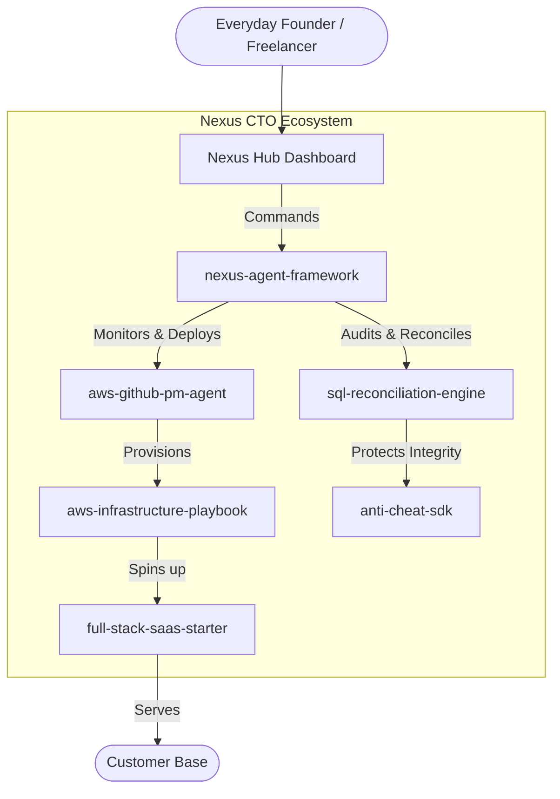

# Nexus CTO: System Architecture

This document defines the high-level ecosystem architecture for combining the standalone repositories into a unified "CTO-as-a-Service" platform.

## Repository Synergy

1. **`nexus-agent-framework`**: The core brain. Listens to user commands and delegates to specialized sub-agents.
2. **`aws-github-pm-agent`**: The DevOps manager. Monitors the SaaS deployment and automatically fixes CI/CD or CloudFormation drift.
3. **`aws-infrastructure-playbook`**: The blueprint. Provides the raw IaC templates that the PM agent executes to build the infrastructure.
4. **`full-stack-saas-starter`**: The payload. The actual web app that is deployed on behalf of the user.
5. **`sql-reconciliation-engine`**: The accountant. Plugs into the deployed SaaS database to audit Stripe/FinOps transactions and prevent revenue leakage.
6. **`anti-cheat-sdk`**: The vault door. Ensures the runtime environment of the agent or the SaaS client is not compromised by malicious injection.
